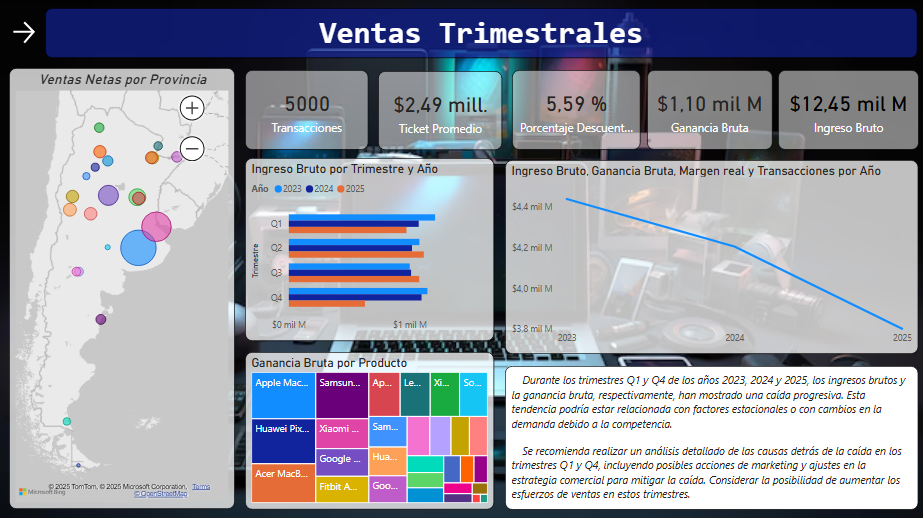

# TP Power BI - Análisis de Ventas

## 📌 Objetivo
Este proyecto corresponde al Trabajo Práctico de **Análisis de Datos**.  
El objetivo es aplicar conocimientos de **Power BI Desktop** para transformar datos crudos, modelar un esquema relacional en estrella y crear un **dashboard interactivo** que facilite la toma de decisiones.

## 🛠️ Requerimientos Técnicos
- Entorno: Power BI Desktop

## 📂 Estructura del Repositorio
```
/data → Archivos utilizados como fuentes 
/pbix → Informe final en Power BI (.pbix) 
/docs → Documento PDF con explicación del ETL y modelado 
README.md
```

## 🔄 Proceso ETL
- Conexión a **4 fuentes de datos** (CSV, txt).
- Transformaciones en Power Query:
  - Renombrado de columnas y tipos de datos
  - Limpieza de valores nulos
  - Creación de columnas calculadas (ej. Importe de línea)
  - Combinación de tablas (merge/anexar)
- Datos listos para modelado relacional.

## 🗂️ Modelado de Datos
- Esquema **estrella** con:
  - Tabla de hechos: `Ventas`
  - Dimensiones: `Productos`, `Clientes`, `Calendario`, `Mapa`
- Relaciones 1:M correctamente definidas.
- Tabla calendario creada en DAX y marcada como Date Table.

## 📊 Dashboard
- Visuales incluidos:
  - Tarjeta KPI (Total Ventas)
  - Gráfico de líneas (tendencia temporal)
  - Gráfico de columnas (ventas por trimestre/año)
  - Matriz con Top 5 de Productos con mayor venta
  - Mapa (ventas por provicias)
- Segmentadores: Periodo, Categoría y Provincias
- Interactividad asegurada entre todos los visuales.


## 📸 Capturas


---

### Autor
- Nombre: Victor Hardy
- Materia: Análisis de Datos
- Universidad/Instituto: Informatorio Chaco
